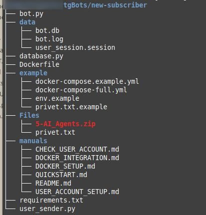
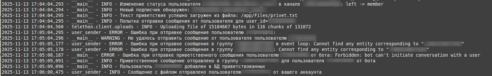
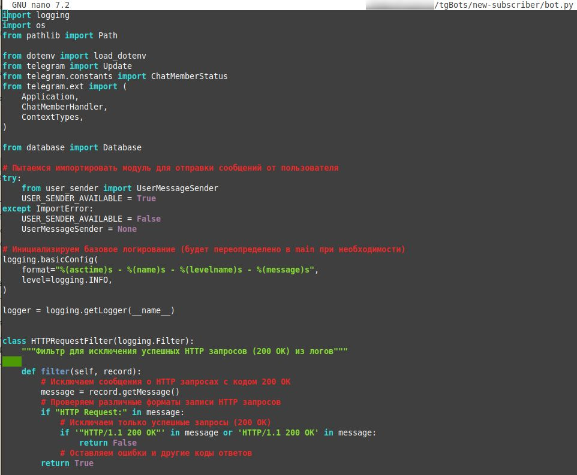
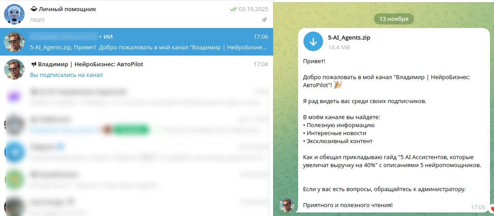

# Автоматический бот на Python  
**Описание скриншотов** 📸

---

[⬅️ Вернуться к описанию проекта](../README.md)

---

### 1. Структура каталогов бота
  

Показана структура директорий бота, развернутого в Docker-контейнере, что обеспечивает удобство управления и масштабирования.

### 2. Лог приветствия нового подписчика
  

Пример записи в лог-файле, фиксирующий факт отправки приветственного сообщения новому подписчику.

### 3. Основной файл бота на Python
  

Фрагмент кода Python-бота, отвечающего за логику приветствий и обработку новых подписчиков.

### 4. Получение приветствия в Telegram
  

Интерфейс пользователя в Telegram с демонстрацией полученного приветственного сообщения от бота.

---

Эти скриншоты показывают профессиональный подход к разработке и развёртыванию телеграм-бота, который эффективно автоматизирует первый контакт с аудиторией и повышает вовлечённость подписчиков.

---

[⬅️ Вернуться к описанию проекта](../README.md)
